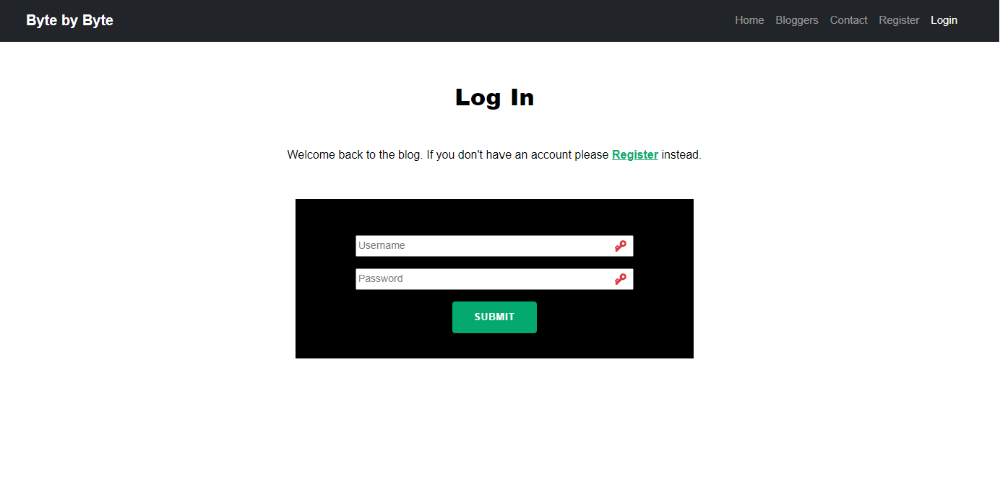
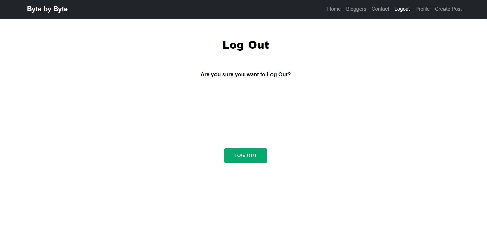
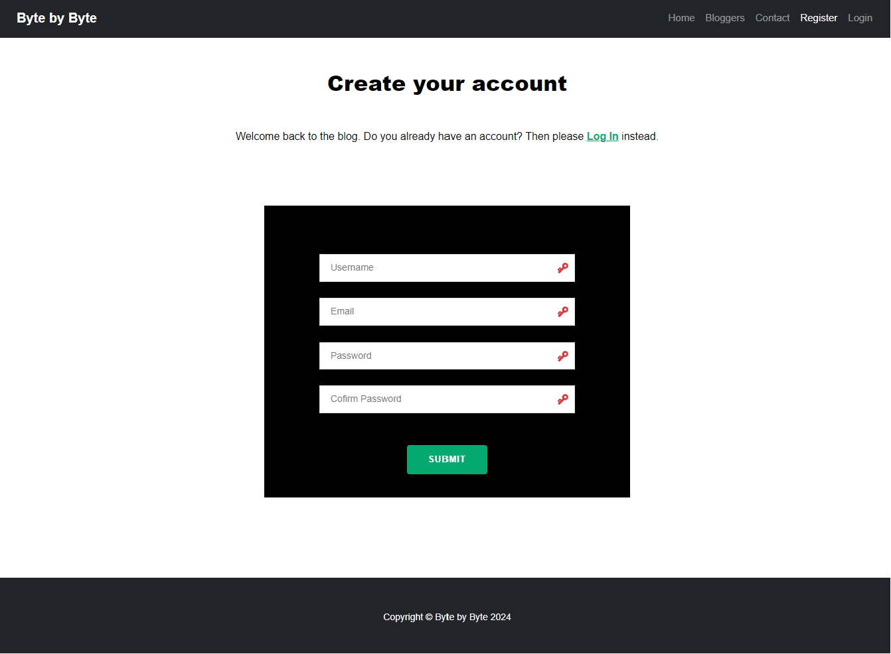
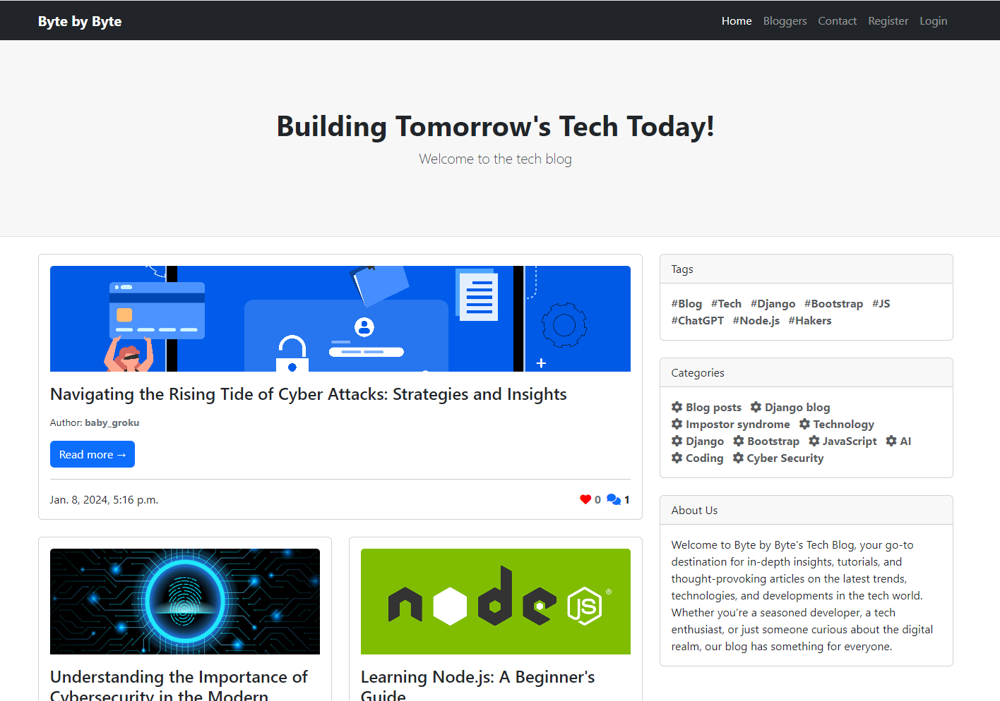
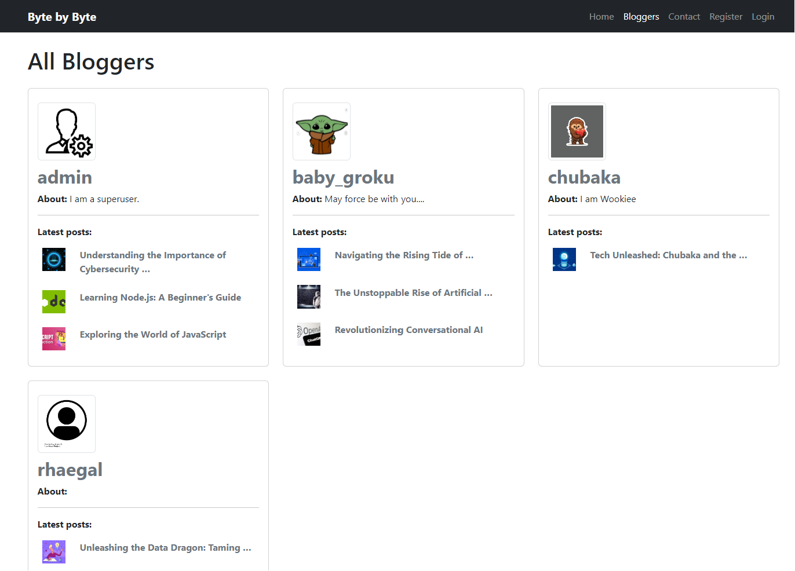
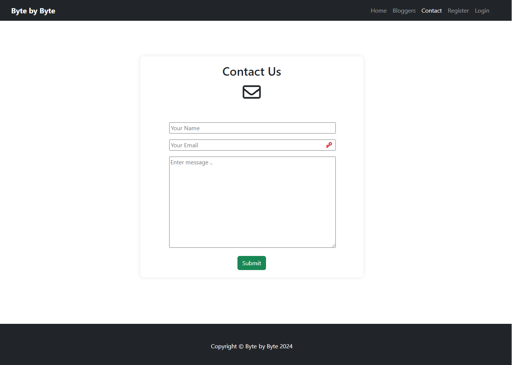
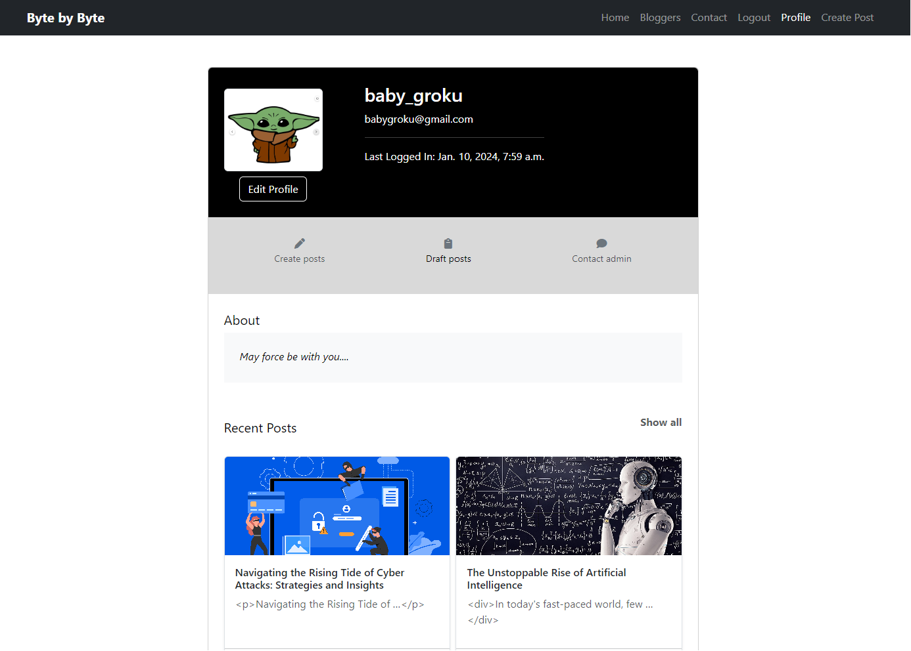
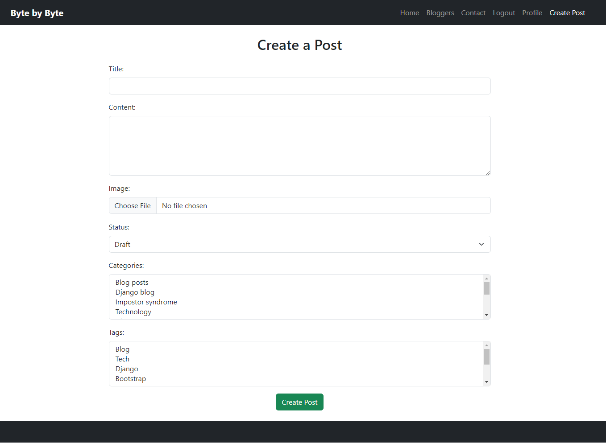
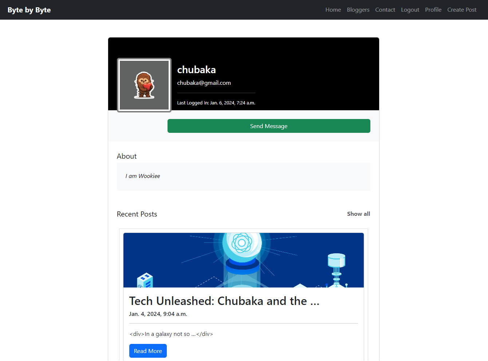

# Byte by Byte

Welcome to Byte by Byte, a Django-based tech blog that delivers in-depth insights, tutorials, and articles on the latest trends and technologies in the tech world.
This application allows user to create, edit, and manage blog posts. It also includes user authentication and comment functionality. Below is guide through the setup and usage of this application.

## Table of Contents
- [Introduction](#introduction)
- [UX](#ux)
- [Flowchart](#flowchart)
- [Features](#features)
- [Potential Future Features](#potential-future-features)
- [Enhancements](#enhancements)
- [Technologies Used](#technologies-used)
- [Deployment](#deployment)
- [Testing](TESTING.md)
- [Credits](#credits)
- [Acknowledgements](#acknowledgements)

## Introduction
Byte by Byte is a platform for tech enthusiasts, developers, and writers. It features a responsive design, user authentication, a comment system, and more.

Access the deployed project at [Byte by Byte](https://final-project-ada-02b27917ae0c.herokuapp.com/).

## UX
### User Stories
Catering to visitors, registered users, and authors/staff members, Byte by Byte covers a wide range of functionalities. Visitors can view and filter posts, registered users can like, comment, and create posts, while authors have extended management capabilities.

Go to [User Stories](https://github.com/users/adamolnar/projects/9/views/1).

#### Table of User Stories

| Role                | User Story                                                                                         | Done  |
|---------------------|----------------------------------------------------------------------------------------------------|-------|
| **Visitor**         | As a Site User I can view a list of posts so that I can select one to read.                        | Yes   |
|                     | As a Site User, I can view a paginated list of posts so that easily select a post to view.         | Yes   |
|                     | As a Site User I can click on a post so that I can read the full text.                             | Yes   |
|                     | As a Site User / Admin I can view comments on an individual post so that I can read the conversation. | Yes   |
|                     | As a Site User, I can send messages through the contact form, so that I can inquire about needed topic. | Yes   |
|                     | As a Site User / Admin I can view the number of likes on each post so that I can see which is the most popular or viral | Yes   |
|                     | As a Site User I can register an account so that I can comment and like.                          | Yes   |
|                     | As a Site User I can easily navigate to post with similar content so that I can find more information about the topic I am interested in. | Yes   |
|                     | As a Site User I can filter posts on category I am interested in so that I can find relevant information faster. | Yes   |
|                     | As a Site User I can see the newest post so that I can be up to date with the blog content.       | Yes   |
|                     | As a Site User, I am presented with a wide range of options for sharing content so I can have quick access to desired content from my email or any other app. | Modified   |
|                     |"As a Site User I can find content by searching for particular words so that I have a quick or less complex way to find content."| No  |
| **Registered User** | As a Site User I can like or unlike a post so that I can interact with the content.                | Yes   |
|                     | As a Site User I can leave comments on a post so that I can be involved in the conversation.       | Yes   |
|                     | As a Site Admin I can create draft posts so that I can finish writing the content later.           | Yes   |
| **Author/Staff**    | As a Site Admin I can approve or disapprove comments so that I can filter out objectionable comments. | Modified   |
|                     | As a Site Admin I can create, read, update, and delete posts so that I can manage my blog content. | Yes   |

These user stories cover a range of user types, including visitors, registered users, and authors/staff members, and address various functionalities and features of the Blog application. 

## Flowchart
The project flowchart was created using <b>LucidChart</b>.

## Features
- User authentication: login, logout, register.
- User profiles for customization and personal information management.
- CRUD operations for blog posts and comments.
- WYSIWYG editor for rich text formatting.
- Author profiles with bio and post links.
- Responsive design using Bootstrap.
- Image uploads with Cloudinary, tagging, categorization.
- Social media sharing buttons.

| Feature | Description | Image |
|---------|-------------|-------|
| Login     | - Users enter their credentials (username/email and password).   - Clear messages for login issues (e.g., incorrect credentials). | 

View Image

 |
| Logout    | -  When a user initiates the logout process, 'Are you sure?' page prompts for confirmation to prevent accidental logouts.   - Users are redirected to the homepage page after logging out. | 

View Image

 |
| Register  | -  Form to capture essential user details (name, email, password).   - Helps users create a strong password.   - Checks for correct format and uniqueness of user information.   - Allows users to log in immediately after registration.| 

View Image

 |
| Index Page  | - The post is presented with an engaging headline and an excerpt or the full content to capture immediate attention.   - Designed to feature the most recent or important blog post, drawing readers in.   - Includes "Previous" and "Next" buttons, enabling users to explore content seamlessly.   - Showcases a list of tags, each linking to a filtered view of blog posts associated with that tag.   - Displays a list of blog categories, allowing users to filter content based on broader topics.   - A dedicated section providing a brief introduction to "Byte by Byte's Tech Blog."  | 

View Image

 |
| Bloggers| - Each blogger is showcased in individual cards within a grid layout.   - Each card features the name of the blogger, which is a clickable link leading to their detailed profile.   A brief description or bio of the author, truncated for brevity.   - Each card lists up to 3 of the latest blog posts by the author, includes a thumbnail of the post image and a truncated title and each post title is a clickable link that directs to the full blog post.   -Provides pagination at the bottom of the page to navigate through the list of bloggers.| 

View Image

 |
| Contact | - The Contact Us page is designed to provide a user-friendly interface for site visitors to reach out to the site administrators or team. It includes several key components for effective communication and user interaction like field validation or submission form feedback message. | 

View Image

 |
| Profile | - This page is designed to display detailed information about a user, their posts, and provide options for profile management.   - Features an 'Edit Profile' button for the user to update their profile (visible only to the profile owner).   - Links for creating new posts, viewing draft posts, and contacting the admin.   - Showcases the user's recent blog posts.   - Provides a 'Delete Profile' button at the bottom of the page (visible only to the profile owner). | 

View Image

 |
| Create Post | - This page is designed for creating a new blog post or updating an existing one. It extends from a base template and includes various form fields for user input.   - Input fields include validation with feedback displayed for any errors.   - The heading is conditionally displayed based on the action:"Create a Post" for new posts or "Update Post" for editing existing posts.   - This template provides a comprehensive interface for blog post creation and editing, ensuring a smooth user experience. | 

View Image

 |
| Read More | - The Blog Post page is designed to display a detailed view of a blog post along with interactive elements like comments and social sharing.   - **Tags**: Lists tags associated with the post, each as a clickable link.   - **Edit, Publish, and Delete Buttons**: Visible only to the post's author for managing the post.   - **Likes**: Users can like the post, with a count of total likes shown.   - **Comments Count**: Shows the number of comments on the post.   - **Social Sharing Buttons**: Allows sharing the post on WhatsApp, Twitter, Facebook, and LinkedIn.   - **Display Comments**: Lists all comments on the post with the commenter's name and date of comment.  - **Comment Moderation**: Update and delete buttons for comment authors to manage their comments.   - **Authentication Check**: Only authenticated users can submit comments.   - **Form Fields**: Provided for users to enter and submit their comments.  - **Registration Prompt**: Unauthenticated users are prompted to register to leave comments.| 

View Image

 |
| Author Page | - This page is designed to showcase detailed information about a blog author, including their profile, recent posts, and a messaging feature. It extends from a base layout, enhancing the user experience with personalized details.   - **Contact Form**: Provides a form for users to send a message to the author, enhancing user-author interaction.   - Lists the author's recent blog posts in a grid layout.   - **Show All Link**: An option for users to view all posts by the author, increasing engagement.| 

View Image

 |

## Potential Future Features
- Implementing a "Save Favorite Posts" feature.
- Scheduling posts for publication.
- Email notifications for new posts.
- Multiple tags and categories assigment.
- Search functionality and performance optimization.

## Enhancements
### Technical Improvements
- Robust search feature for content discoverability.
- Performance optimization using caching.
- SEO enhancements for increased organic traffic.
- Full accessibility compliance.

### User Engagement and Community Features
- Enhanced user profiles with more customization.
- Community forum for user discussions.
- Interactive tutorials and quizzes.
- Encouraging user-generated content.

### Monetization Strategies
- Membership or subscription models.
- Affiliate marketing and sponsored posts.
- Advertisements targeting tech audiences.

### Analytics and Feedback
- Advanced analytics for tracking user behavior and content popularity.
- Tools for collecting user feedback.
- Regular A/B testing for feature and design enhancements.

### Security Enhancements
- Regular security audits.
- Implementation of Two-Factor Authentication (2FA) for user accounts.

## Technologies Used
- Django
- PostgreSQL
- Bootstrap
- Cloudinary
- django-summernote
- And more [requirements.txt](requirements.txt)

## Deployment
This project was deployed using Code Institute's mock terminal for Heroku.

1. Create Pipfile 
 In the terminal enter the command ` pip3 freeze > requirements.txt`, and a file with all requirements will be created. 
 
 2. Setting up Heroku
    - Go to the Heroku website [here](https://www.heroku.com/).
    - Login to Heroku and choose *Create App* 
    - Click *New* and *Create a new app*
    - Choose a name and select your location
    - Go to the *Resources* tab 
    - From the Resources list select *Heroku Postgres*
    - Navigate to the *Deploy* tab
    - Click on *Connect to Github* and search for your repository
    - Navigate to the *Settings* tab
    - Reveal Config Vars and add your Cloudinary, Database URL (from Heroku-Postgres) and Secret key.    

3. Deployment on Heroku
    - Go to the Deploy tab.
    - Choose the main branch for deploying and enable automatic deployment 
    - Select manual deploy for building the App 

#### Fork the repository
For creating a copy of the repository on your account and change it without affecting the original project, use<b>Fork</b> directly from GitHub:
- On [My Repository Page](https://github.com/adamolnar/Final_Project?tab=readme-ov-file), press <i>Fork</i> in the top right of the page
- A forked version of my project will appear in your repository  

#### Clone the repository
For creating a clone of the repository on your local machine, use<b>Clone</b>:
- On [My Repository Page](https://github.com/adamolnar/Final_Project?tab=readme-ov-file), click the <i>Code</i> green button, right above the code window
- Chose from <i>HTTPS, SSH and GitClub CLI</i> format and copy (preferably <i>HTTPS</i>)
- In your <i>IDE</i> open <i>Git Bash</i>
- Enter the command <code>git clone</code> followed by the copied URL
- Your clone was created

## Testing
The testing documentation can be found in the [Testing Documentation](TESTING.md).

## Credits
- Code Institute for the deployment terminal [CodeInstitute: FST101](https://learn.codeinstitute.net/courses/course-v1:CodeInstitute+FST101+2/courseware/b31493372e764469823578613d11036b/ae7923cfce7f4653a3af9f51825d2eba/).
- Code Institute Project Scope [Code Institute || I Think Therefore I Blog](https://learn.codeinstitute.net/courses/course-v1:CodeInstitute+FST101+2/courseware/b31493372e764469823578613d11036b/fe4299adcd6743328183aab4e7ec5d13/).
- Django Tutorial [Mmdm](https://developer.mozilla.org/en-US/docs/Learn/Server-side/Django/Models).
- Bootstrap documentation [Bootstrap Documentetion](https://getbootstrap.com).
- How to add Social Share buttons in Django [Tutorialspoint](https://www.tutorialspoint.com/how-to-add-social-share-buttons-in-django).
- 404 page [CodePen](https://codepen.io/Navedkhan012/pen/vrWQMY).
- Bootstrap blog theme [Startbootstrap](https://startbootstrap.com/previews/blog-home).
- Django blog tutorial [Dontrepeatyourself](https://dontrepeatyourself.org/post/django-blog-tutorial-part-3-users-authentication/#profile-page?utm_content=cmp-true).
- Automated testing with [Code Institute || Python Testing](https://learn.codeinstitute.net/courses/course-v1:CodeInstitute+PT101+2021_T1/courseware/f20cd699fac3480b99004d1fc3f265ef/bfd6dc4d46c94af89af71f2525c66e0f/).
- Automated testing with [Realpython](https://realpython.com/testing-in-django-part-1-best-practices-and-examples/#testing-models).
- README layout from [Christian Göran](https://github.com/christiangoran/dome-restaurant-repo/blob/main/README.md).
- The content of posts was generated with the assistance of [ChatGPT](https://www.openai.com/gpt-3/).

## Media
- Image for blog post 'How to Write an Effective Blog Post: A Step-by-Step Guide' [The Anatomy of a Perfect Blog Post](https://www.salesforce.com/ca/blog/2016/08/anatomy-of-a-perfect-blog-post.html).
- Image for blog post 'Django Form: From Zero to Hero - Mastering Form Handling' [Java67](https://www.java67.com/2020/06/top-5-courses-to-learn-django-and-python-for-web-development.html).
- Image for blog post 'Navigating Impostor Syndrome as a Software Developer' [Hackernoon](https://hackernoon.com/the-impostor-syndrome-among-us).
- Image for blog post 'Mastering Web Design with Bootstrap: A Comprehensive Guide' [Cloudways](https://www.cloudways.com/blog/laravel-bootstrap-template-integration/).
- Image for blog post 'Exploring the World of JavaScript' [eMyAcademy](https://emyacademy.com/course-category/coding/).
- Image for blog post 'Revolutionizing Conversational AI' [OnManorama](https://www.onmanorama.com/news/business/2023/02/11/google-calls-chat-gpt-hallucinating-chatbot.html).
- Image for blog post 'The Unstoppable Rise of Artificial Intelligence' [Chi](https://www.writerchi.com/post/conversational-ai-the-future-to-be).
- Image for blog post 'Tech Unleashed: Chubaka and the Wookiee Wonders of the Digital World' [OSecrate](https://osecrate.info/quantum-cryptography-os-exploring-foundations-applications/).
- Image for blog post 'Unleashing the Data Dragon: Taming Big Data for Business Success' [AppSumo Blog](https://blog.appsumo.com/blog-post-ideas/).
- Image for blog post 'Learning Node.js: A Beginner's Guide' [DEV Community](https://dev.to/burakboduroglu/building-a-nodejs-server-without-using-expressjs-3mc8).
- Image for blog post 'Understanding the Importance of Cybersecurity in the Modern World' [InterCore Technologies](https://www.linkedin.com/company/intercoretech/about/).
- Image for blog post 'Navigating the Rising Tide of Cyber Attacks: Strategies and Insights' [Medium](https://jerry-lawrence789.medium.com/10-security-vulnerabilities-in-web-applications-and-how-to-avoid-them-738d73183028).
- Profile image for author admin [Krissping Computer](https://plautz-frisch-ins-haus.at/kisspng-computer-icons-icon-design-business-administration-admin-icon-5b46fc469cf717-2503725715313787586429/).
- Profile image for author baby_groku [Vector](https://www.freevector.com/vector/stars-wars).
- Profile image for author chubaka [Vector](https://www.freevector.com/vector/stars-wars).

## Acknowledgements
- Code Institute for providing a great course and support.
- My mentor Gareth McGirr for great guidance and support.
- Slack community for solving roadblocks together and helping each other unconditionally.

