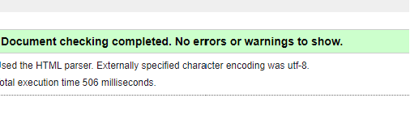
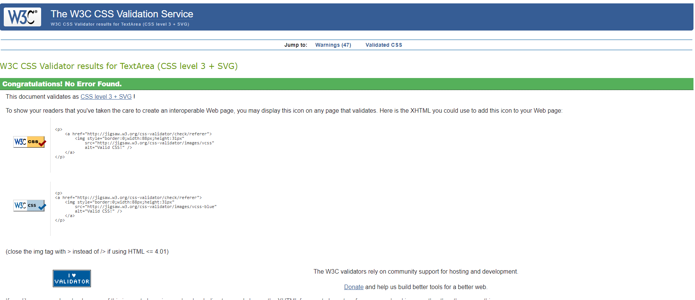
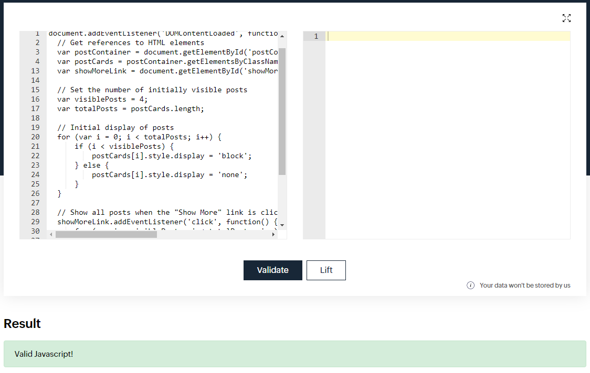
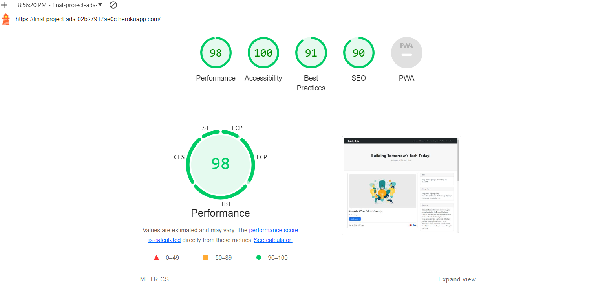
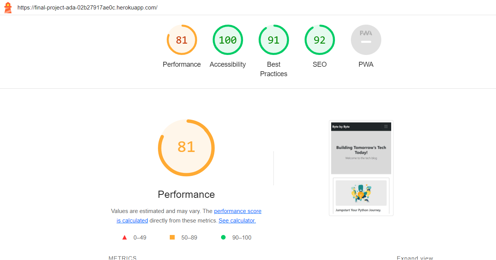

# Testing Documentation

## Table of Contents
1. [Manual Testing](#manual-testing)
2. [Automated Testing](#automated-testing)
3. [Browser Testing](#browser-testing)
4. [Code Validation](#code-validation)
   - [HTML](#html)
   - [CSS](#css)
   - [Javascript](#javascript)
5. [Python](#python)
6. [Performance](#performance)

## Input validation and error checking

### Manual Testing 

The testing documentation can be found in [Manual Testing Documentation](MANUAL_TESTING.md) 

### Automated Testing
The testing documentation for various components can be found in the following files:
- [test admin.py](tests/test_admin.py)
- [test models.py](tests/test_models.py)
- [test views.py](tests/test_views.py)

Note: Due to the project size and hard deadline, 100% coverage was not achieved.

### Browser Testing
The website was tested on several browsers to ensure functionality and compatibility:
- Safari
- Chrome
- Firefox
- Edge
- Opera

### Code Validation

#### HTML
The HTML code of the website was validated using the [W3 Markup Validator](https://validator.w3.org/). The validation results at the time of deployment are as follows:

#### CSS
The CSS code was validated using the [W3 Jigsaw Validator](https://jigsaw.w3.org/css-validator/). The validation results for *style.css* at the time of deployment are as follows:

#### Javascript
Javascript functionality includes a timer for user notification and a toggle for displaying posts. The code was validated with [Site24X7](https://www.site24x7.com/de/tools/javascript-validator.html).

    setTimeout(function () {
                let messages = document.getElementById('msg');
                let alert = new bootstrap.Alert(messages);
                alert.close();
            }, 4000);

 

    // To display four recent posts in profile.html and provide a "Show More" link to reveal additional posts
    document.addEventListener('DOMContentLoaded', function() {
        // Get references to HTML elements
        var postContainer = document.getElementById('postContainer');
        var postCards = postContainer.getElementsByClassName('extrapost');
        var showMoreLink = document.getElementById('showMoreLink');

    // Set the number of initially visible posts
    var visiblePosts = 4;
    var totalPosts = postCards.length;

    // Initial display of posts
    for (var i = 0; i < totalPosts; i++) {
        if (i < visiblePosts) {
            postCards[i].style.display = 'block';
        } else {
            postCards[i].style.display = 'none';
        }
    }

    // Show all posts when the "Show More" link is clicked
    showMoreLink.addEventListener('click', function() {
        for (var i = visiblePosts; i < totalPosts; i++) {
            postCards[i].style.display = 'block';
        }

        // Hide the "Show More" link after revealing all posts
        showMoreLink.style.display = 'none';
    });
  });

#### Python

### Performance
The website's performance was assessed using [Google Lighthouse](https://developer.chrome.com/docs/lighthouse/overview/)

- Desktop Assesment

- Mobile Assesment

