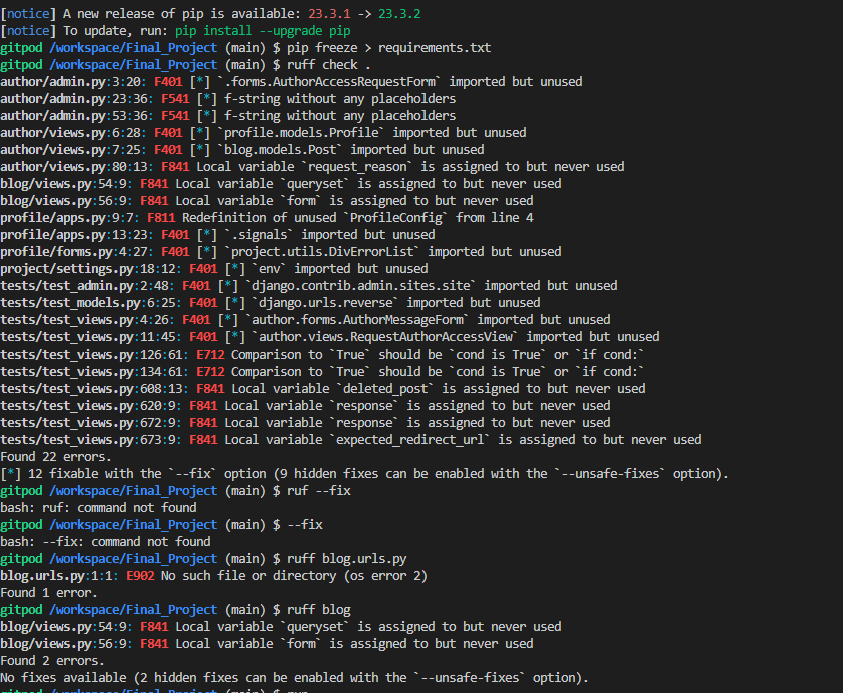
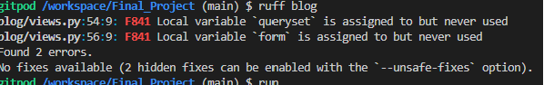

## Input validation and error checking

### Manual Testing 

The testing documentation can be found in [MANUAL_TESTING.md](MANUAL_TESTING.md) 

### Automated Testing 

The testing documentation can be found in [test admin.py](tests/test_admin.py) 
[test models.py](tests/test_models.py)
[test views.py](tests/test_views.py)

Due to the project size and hrd deadline no coverage of 100% were achieved.

  
 

### Browser Testing

The website was tested on different browser for assuring the features work accordingly.
* Safari
* Chrome
* Firefox
* Edge
* Opera

### Code Validation

#### HTML

The html code of the website was validated using [W3 Markup Validator](https://validator.w3.org/). 
At the time of deployment the validation have the following outcome:  

  
 

#### CSS

The CSS code was validated using [W3 Jigsaw Validator](https://jigsaw.w3.org/css-validator/) 
At the time of deployment the validation for *style.css* has the following outcome:  

  
 

#### Javascript

Function used from [I Think Therefore I Blog.](https://learn.codeinstitute.net/courses/course-v1:CodeInstitute+FST101+2/courseware/b31493372e764469823578613d11036b/ae7923cfce7f4653a3af9f51825d2eba/) removes the user notification windows after four seconds and is written straight into the base.html.

    setTimeout(function () {
                let messages = document.getElementById('msg');
                let alert = new bootstrap.Alert(messages);
                alert.close();
            }, 4000);

Function to toggle posts on author_detail.html template and profile.html template, if it is more than 4. Validated with [Site24X7](https://www.site24x7.com/de/tools/javascript-validator.html).

  // To display four recent posts in profile.html and provide a "Show More" link to reveal additional posts
  document.addEventListener('DOMContentLoaded', function() {
    // Get references to HTML elements
    var postContainer = document.getElementById('postContainer');
    var postCards = postContainer.getElementsByClassName('extrapost');
    var showMoreLink = document.getElementById('showMoreLink');

    // Set the number of initially visible posts
    var visiblePosts = 4;
    var totalPosts = postCards.length;

    // Initial display of posts
    for (var i = 0; i < totalPosts; i++) {
        if (i < visiblePosts) {
            postCards[i].style.display = 'block';
        } else {
            postCards[i].style.display = 'none';
        }
    }

    // Show all posts when the "Show More" link is clicked
    showMoreLink.addEventListener('click', function() {
        for (var i = visiblePosts; i < totalPosts; i++) {
            postCards[i].style.display = 'block';
        }

        // Hide the "Show More" link after revealing all posts
        showMoreLink.style.display = 'none';
    });
  });

 

### Python

Due to the project size, the python code was tested using [Ruff Linter](https://astral.sh/ruff). 
Author, blog, profile app after checking for errors, were corrected.

  

  

 

### Performance

The performance of the website was tested with [Google Lighthouse](https://developer.chrome.com/docs/lighthouse/overview/)

**Lighthouse reports:** 

Desktop

 

Mobile
 
  

